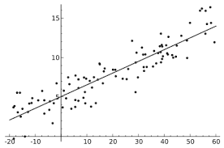
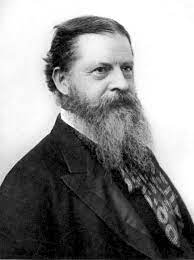
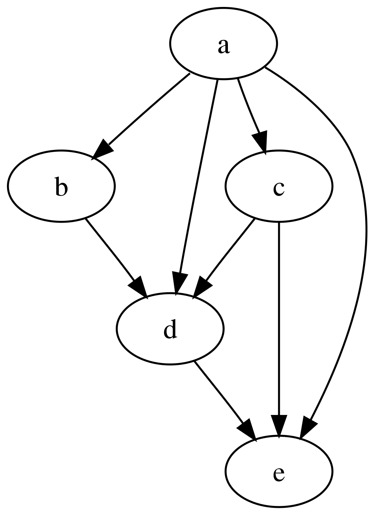

&nbsp; &nbsp;  &nbsp;  &nbsp; &nbsp;

# What Good is a Regression? *Inference to the Best Explanation* and the Practice of Political Science Research

Paper and related materials for  [Spirling](http://arthurspirling.org/) and [Stewart](https://scholar.princeton.edu/bstewart/home) (2022). The abstract for the paper is as follows:

> We argue that almost all empirical social science research  employs a mode of argumentation called "Inference to the Best Explanation" (IBE). While IBE is widely used, it is seldom explicated,  leading to confusion about the role that evidence plays in social science claims.  We describe what IBE is and its implications for the evaluation of studies of various types---from quantitative description, to traditional regression studies, to work with modern causal identification. We contend that debates over the merits of these approaches should be understood as debates over the relative weight scholars place on quality of explanations, the quality of evidence and the bridge between the two. Seeing the process this way helps highlight the merits of different research traditions and explains common pathologies of the same. Informed by IBE, we clarify the motivation for certain advice in regression studies and offer guidance on  best practice.

You can find the paper [here](https://github.com/ArthurSpirling/InferenceToTheBestExplanation/blob/main/paper/Spirling_Stewart_WhatGoodIsARegression.pdf). Comments are extremely welcome. Please email us or open an `issue` here. 

