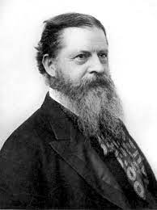
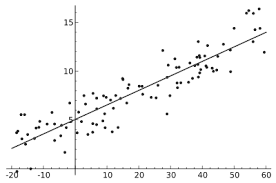
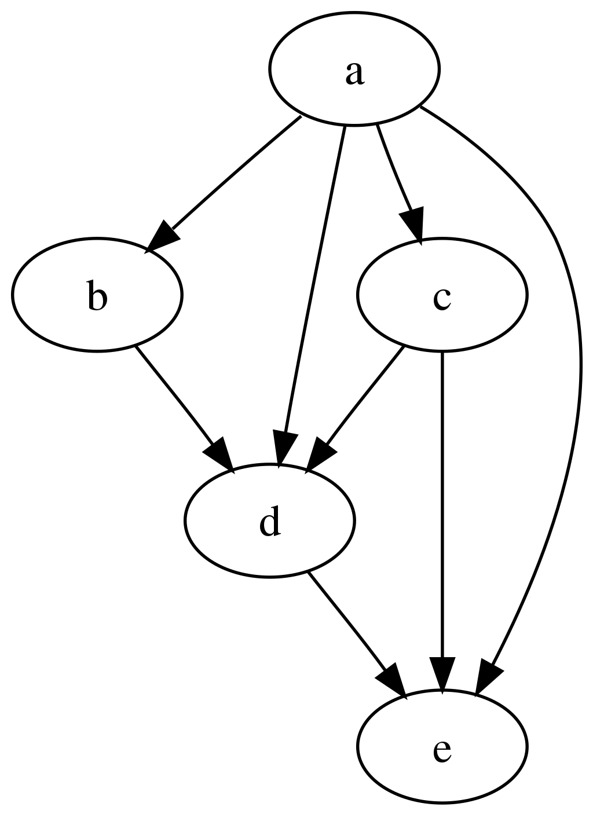
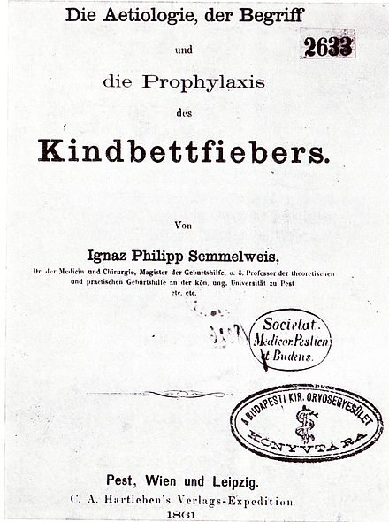

 

# What Good is a Regression? *Inference to the Best Explanation* and the Practice of Political Science Research

Paper and related materials for  [Spirling](http://arthurspirling.org/) and [Stewart](https://scholar.princeton.edu/bstewart/home) (2022). The abstract for the paper is as follows:

> We consider the claim that political science research has become too focused on causal inference at the expense of substantive concerns.  We contend that debates on this question are unproductive because they fail to recognize that almost all empirical social science research uses "Inference to the Best Explanation" (IBE) and must be assessed in that light. Noting its wide acceptance and use elsewhere, we review the basic principles of IBE, and examine its ubiquity in our discipline. We show that disputes regarding the merits of different approaches can be reduced to debates over the relative weight scholars place on quality of inference versus quality of explanation. We argue that many pathologies of current practice can be both explained and potentially ameliorated this way. These include incentives to *p*-hack, the undervaluing of description, and the confusion over the value of non-plausibly causally identified studies. Explicitly embracing IBE helps structure discussions in the discipline.

You can find the paper [here](https://github.com/ArthurSpirling/InferenceToTheBestExplanation/blob/main/Spirling_Stewart_WhatGoodisARegression.pdf). Comments are extremely welcome. Please email us or open an `issue` here. 

